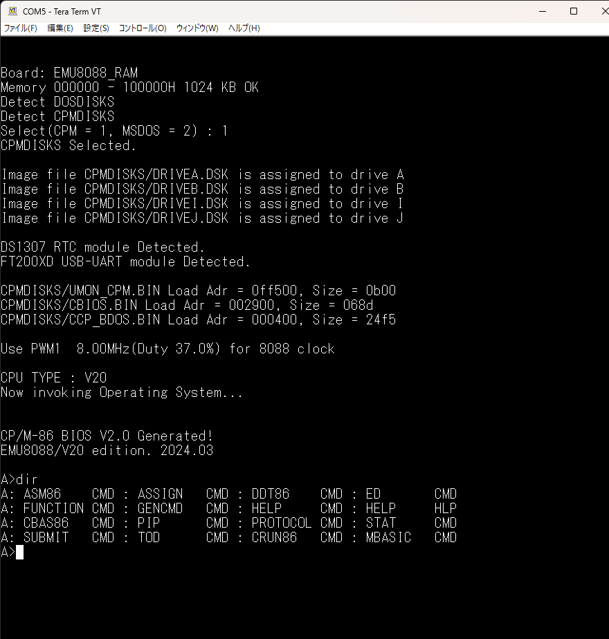
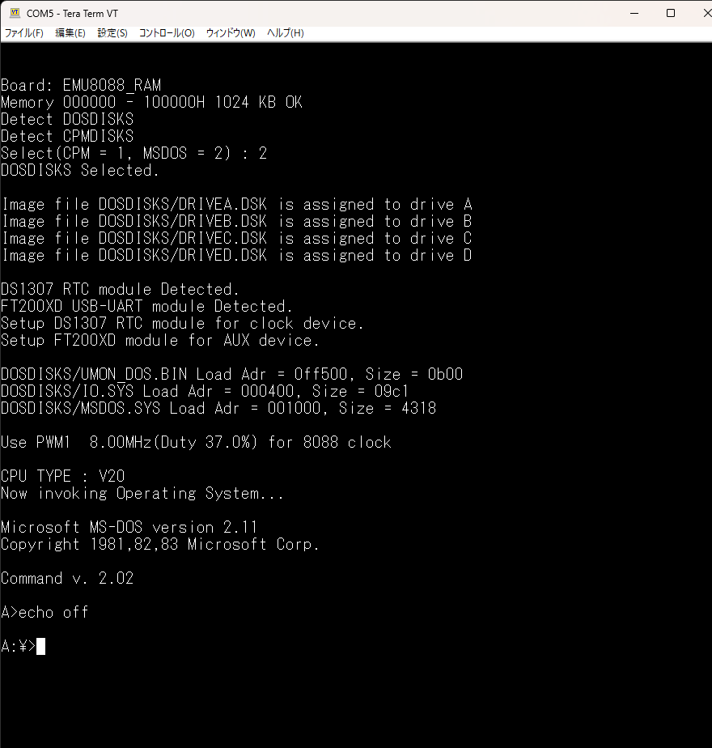
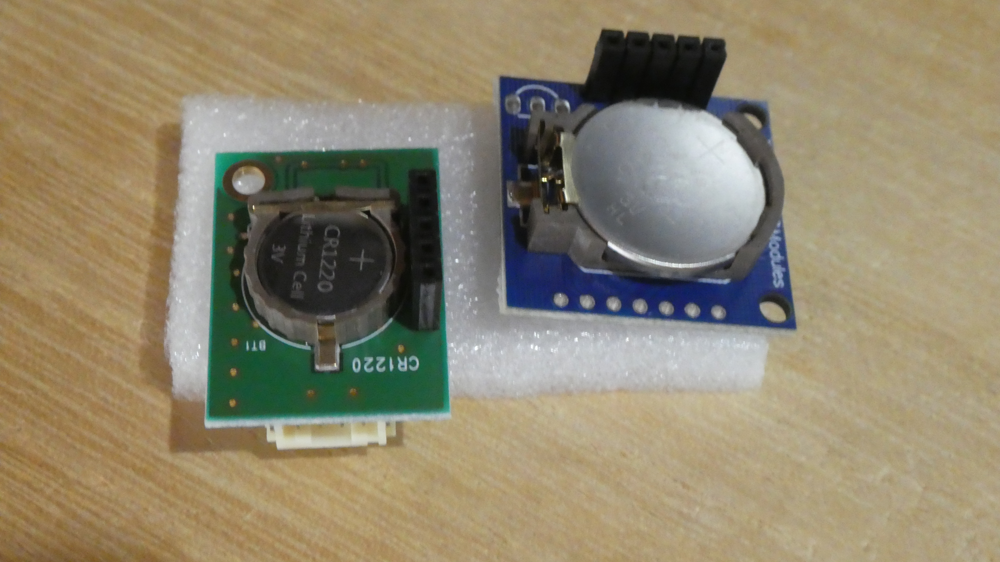

# EMU57Q-8088/V20 
 
PIC18F57Q43を使った8088/用のSBCを作成し、CPM-86とMD-DOS2.11を移植し公開しています。 
SBCをRev2.1にバージョンアップしました。 
8088/V20が4.9MHz、または8MHzで動作します。 

EMU57Q-8088/V20 Rev2.1ボード

Rev2.1では、新たにI2Cをサポートしています。 

SBCとI2Cモジュール

また、新規ファームウェアでは、起動時ＯＳを選択出来るようにしました。 
ファイルは、CPM-86用のディレクトリファイルと、MS-DOS用のディレクトリ 
ファイルが用意されています。 
両方のディレクトリファイルをSDカードにコピーすると、どちらのOSを 
起動時するのかをパワーオン／リセット時に聞いてきます。 
単一のディレクトリファイルをコピーした場合には、コピーしたOSが起動します。 
 

CP/M-86起動画面

MS-DOS起動画面

# I2Cのサポート 
MS-DOSのクロックデバイスをサポートするためには、リアルタイムクロック 
（RTC）が必要です。 
PIC18F57Q43にはRTC機能はありません。 
（タイマーを使って疑似的に1秒を作り出すことはできます。） 
商業用にI2C機能を使ったRTCモジュールが販売されています。 
PIC18F57Q43にはI2C機能があるので、これを使えばRTC機能を持たせることが可能となります。 
 
そういった理由から、I2Cをサポートすることにしました。 
また、I2Cを使えば、商業用に販売されている色々なデバイスを動かす 
ことが出来ます。 
（当然対応するプログラムを作成する必要がありますが・・・） 
RTCモジュールとしてサポートしているのは、DS1307を使用したモジュール 
となります。また、I2C経由でUSB-UARTに接続するモジュール（FT200-XD)の 
サポートも実装してあります。 
 
I2Cが使えるのは、MS-DOSのみとなっています。CPM-86では扱っていません。 
 
I2Cのサポートについては、@etoolsLab369さんのページが非常に参考になりました。 
感謝いたします。 
 
（18F27Q43 2台を使ってHost-Client通信） 
https://qiita.com/etoolsLab369/items/65befd8fe1cccd3afc33 
 
 
＜DS1307を使ったRTCモジュール＞

AE-DS1307：　秋月電子通商で入手できます。 
https://akizukidenshi.com/catalog/g/g115488/ 
 
Tiny RTC modules：　amazon、その他有名webストアで入手できます。 
説明書も何もありませんが、amazonに図面入りのレビューがありました。 
 
 
＜FT200XDを使ったUSB-UART接続モジュール＞

MFT200XD：　マルツのwebストアで入手できます。amazonからでも入手できます。 
https://www.marutsu.co.jp/pc/i/243038/ 
 
CJMCU-200：　amazon、その他有名webストアで入手できます。 
説明書も何もありませんでしたが、問題なく使えました。 
 
 
# ファームウェア
@hanyazouさんが作成したZ80で動作しているCP/M-80のFWをベースに、 
EMU8088_57Q用のFWとして動作するように修正を加えました。 
今回は、CPM-86とMS-DOSを、SDカード上にバイナリファイルとして扱っています。 
 
(CPM-86) 
--CPMDISKSディレクトリ 
　　CBIOS.BIN　　　　BIOSバイナリファイル 
　　CCP_BDOS.BIN　　　CCP, BDOSバイナリファイル 
　　UMON_CPM.BIN　　　UNIMONのバイナリファイル 
　　DRIVEA.DSK　　　　Aドライブのディスクイメージ 
　　DRIVEB.DSK　　　　Bドライブのディスクイメージ 
　　DRIVEI.DSK　　　　Iドライブのディスクイメージ 
　　DRIVEJ.DSK　　　　Jドライブのディスクイメージ 
 
(MS-DOS) 
--DOSDISKSディレクトリ 
　　IO.SYS　　　　　　IOデバイスドライバのバイナリファイル 
　　MSDOS.SYS　　　　MS-DOS本体のバイナリファイル 
　　UMON_DOS.BIN　　　UNIMONのバイナリファイル 
　　DRIVEA.DSK　　　　Aドライブのディスクイメージ 
　　DRIVEB.DSK　　　　Bドライブのディスクイメージ 
　　DRIVEC.DSK　　　　Cドライブのディスクイメージ 
　　DRIVED.DSK　　　　Dドライブのディスクイメージ 
 
MS-DOS、CPM-86については、以下を参照してください。 
 
https://github.com/akih-san/EMU8088_57Q_V2_CPM86 
https://github.com/akih-san/EMU8088_MSDOS211 
 
 
＜＠hanyazouさんのソース＞ 
https://github.com/hanyazou/SuperMEZ80/tree/mez80ram-cpm 
 
＜@electrelicさんのユニバーサルモニタ(UNIMON)＞ 
https://electrelic.com/electrelic/node/1317 
 
 
# 参考
・EMUZ80 
EUMZ80はZ80CPUとPIC18F47Q43のDIP40ピンIC2つで構成されるシンプルな 
コンピュータです。 
 
＜電脳伝説 - EMUZ80が完成＞   
https://vintagechips.wordpress.com/2022/03/05/emuz80_reference   
＜EMUZ80専用プリント基板 - オレンジピコショップ＞   
https://store.shopping.yahoo.co.jp/orangepicoshop/pico-a-051.html 
 
・SuperMEZ80 
SuperMEZ80は、EMUZ80にSRAMを追加し、Z80をノーウェイトで動かすことができるメザニンボードです 
 
SuperMEZ80 
https://github.com/satoshiokue/SuperMEZ80 
 
